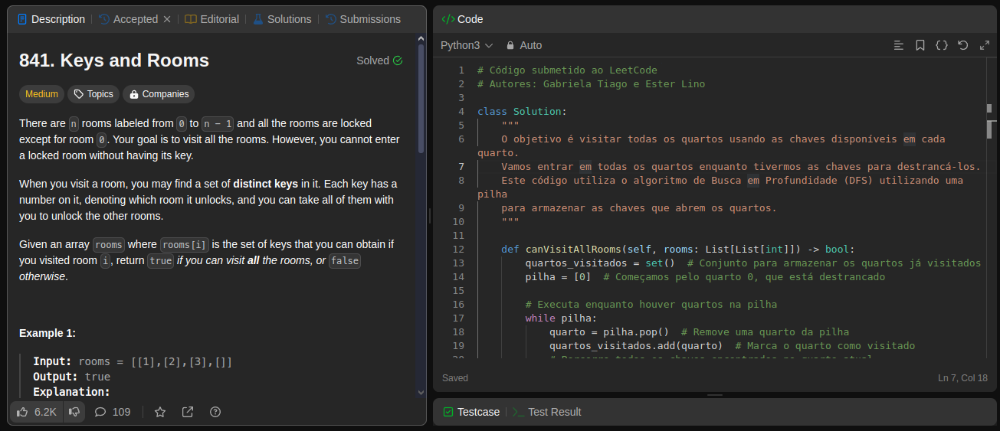
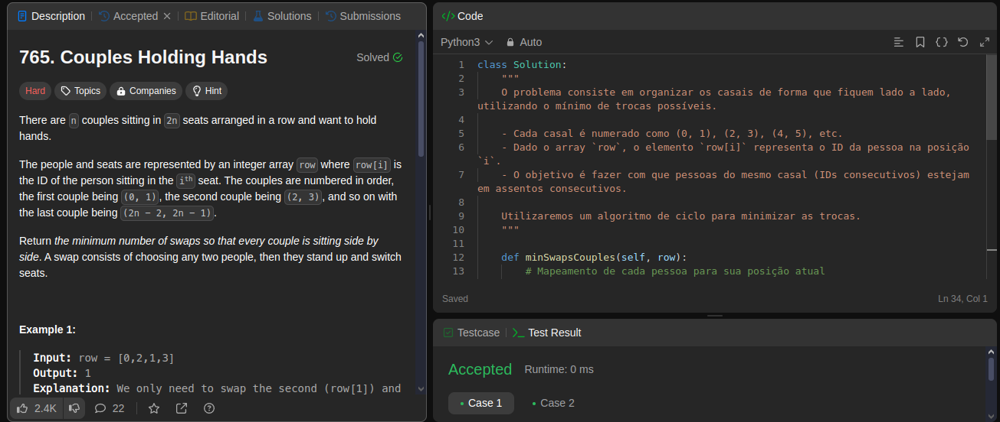

# LeetCode Problems

**Número da Lista**: 39 
**Conteúdo da Disciplina**: Grafos 01 

## Alunos

| Matrícula | Aluno                      |
| --------- | -------------------------- |
| 202063201 | Ester Flores Lino da Silva |
| 190028475 | Gabriela Tiago de Araujo   |

## Sobre

Este repositório tem como objetivo a resolução de exercícios da plataforma LeetCode sobre o conteúdo de Grafos 1, representando assim a entrega do trabalho 1 da disciplina Projeto de Algoritmos.

| Código | Nome                                                                                                            | Dificuldade |
| :----: | --------------------------------------------------------------------------------------------------------------- | :---------: |
|  841   | [Keys and Rooms](https://leetcode.com/problems/keys-and-rooms/description/)                                     |    Médio    |
|  2924  | [Find Champion II](https://leetcode.com/problems/find-champion-ii/description/)                                 |    Médio    |
|  847   | [Shortest Path Visiting All Nodes](https://leetcode.com/problems/shortest-path-visiting-all-nodes/description/) |   Difícil   |
|  765   | [Couples Holding Hands](https://leetcode.com/problems/couples-holding-hands/description/)                       |   Difícil   |

## Screenshots

**Exercício 841**

**Exercício 2924**

**Exercício 847**

**Exercício 765**

## Instalação

**Linguagem**: Python 
**Pré-requisitos**: Possuir Python instalado na máquina. 

## Uso

Para verificar os exercícios, os códigos devem ser executados na plataforma [LeetCode](https://leetcode.com/).

## Vídeos de apresentação

-   [Link do vídeo de explicação do exercício 841](https://unbbr.sharepoint.com/:v:/s/ProjetodeAlgoritmos247/EUQZF9B2F7tHg8JEgZbGwFgBbh-BfRx8gdHogEjSQ7baxQ?e=jYZGxZ&nav=eyJyZWZlcnJhbEluZm8iOnsicmVmZXJyYWxBcHAiOiJTdHJlYW1XZWJBcHAiLCJyZWZlcnJhbFZpZXciOiJTaGFyZURpYWxvZy1MaW5rIiwicmVmZXJyYWxBcHBQbGF0Zm9ybSI6IldlYiIsInJlZmVycmFsTW9kZSI6InZpZXcifX0%3D)
-   [Link do vídeo de explicação do exercício 2924](https://www.youtube.com/watch?v=KmBRY8uAa64)
-   [Link do vídeo de explicação do exercício 847](https://www.youtube.com/watch?v=NdysgE0QrTI)
-   [Link do vídeo de explicação do exercício 765](https://unbbr.sharepoint.com/:v:/s/ProjetodeAlgoritmos247/EfFljnOu9URHh9m_dMSLnR0BLpXoEjYY0i7mfncL1HT0gA?e=dVbzm2&nav=eyJyZWZlcnJhbEluZm8iOnsicmVmZXJyYWxBcHAiOiJTdHJlYW1XZWJBcHAiLCJyZWZlcnJhbFZpZXciOiJTaGFyZURpYWxvZy1MaW5rIiwicmVmZXJyYWxBcHBQbGF0Zm9ybSI6IldlYiIsInJlZmVycmFsTW9kZSI6InZpZXcifX0%3D)
