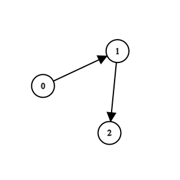
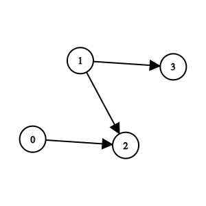

# Exercício 2924 - Find Champion II

## Descrição

Há `n` equipes numeradas de `0` a `n - 1` em um torneio; cada equipe também é um nó em um **DAG**.

Você recebe o inteiro `n` e uma matriz de inteiros 2D **indexada em 0** `edges` de comprimento `m` representando o **DAG**, onde indica que há uma aresta direcionada de equipe para equipe no gráfico. `edges[i] = [ui, vi]` `ui` `vi`

Uma aresta direcionada de `a` para `b` no gráfico significa que a equipe `a` é **mais forte** que a equipe `b` e a equipe `b` é **mais fraca** que a equipe `a`.

A equipe `a` será **campeã** do torneio se não houver nenhuma equipe `b` mais **forte** que a equipe `a`.

Retorne o time que será **campeão** do torneio se houver um campeão **único** , caso contrário, retorne `-1`.

## Notas

- Um **ciclo** é uma série de nós tais que o nó é o mesmo nó que o nó, os nós são distintos e há uma aresta direcionada do nó ao nó para cada nó no intervalo `a1, a2, ..., an, an+1` `a1` `an+1` `a1, a2, ..., an` `ai` `ai+1` `i` `[1, n]`
- Um **DAG** é um grafo direcionado que não possui nenhum **ciclo**.

## Exemplo 1

Entrada: `n = 3`, `arestas = [[0,1],[1,2]]` 
Saída: `0` 
Explicação: `O time 1 é mais fraco que o time 0. O time 2 é mais fraco que o time 1. Então. o campeão é o time 0.`

## Exemplo 2

Entrada: `n = 4`, `arestas = [[0,2],[1,3],[1,2]]`
Saída: `-1`
Explicação: `O time 2 é mais fraco que o time 0 e o time 1. O time 3 é mais fraco que o time 1. Mas o time 1 e o time 0 não são mais fracos que nenhum outro time. Então, a resposta é -1.`

## Restrições

- `1 <= n <= 100`
- `m == edges.length`
- `0 <= m <= n * (n - 1) / 2`
- `edges[i].length == 2`
- `0 <= edge[i][j] <= n - 1`
- `edges[i][0] != edges[i][1]`
- A entrada é gerada de forma que se o time `a` for mais forte que o time `b`, o time `b` não será mais forte que o time `a`.
- A entrada é gerada de forma que se a equipe `a` for mais forte que a equipe `b` e a equipe `b` for mais forte que a equipe `c`, então a equipe `a` será mais forte que a equipe `c`.
